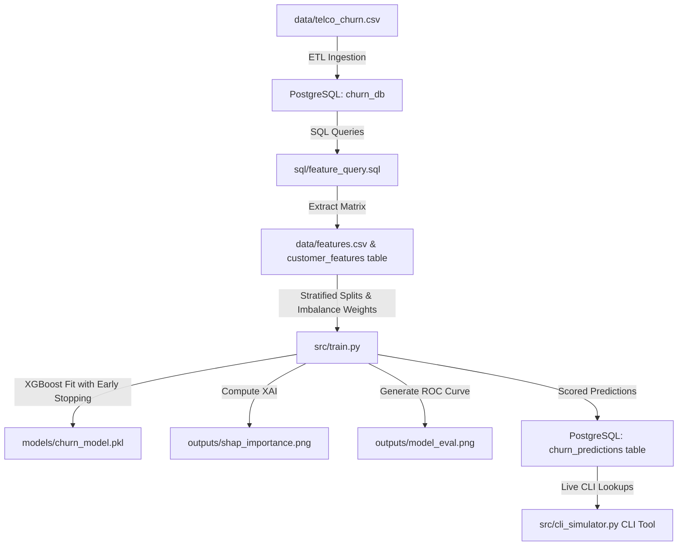

# 🛡️ Telecom Customer Churn Prediction System


An end-to-end, production-grade machine learning system that predicts which telecom subscribers are at risk of churning. It leverages **PostgreSQL** for data storage and feature aggregations, **XGBoost** for classification, and **SHAP** for explainable AI. The predictions and simulations are accessed via an interactive, terminal-based **Python CLI Simulator**.

---

## 🏗️ Project Architecture



---

## 🛠️ Tech Stack
*   **Language**: Python 3.11.9 (managed via `pyenv`)
*   **Database**: PostgreSQL (`churn_db`)
*   **ORMs & Connections**: SQLAlchemy & Psycopg2
*   **Machine Learning**: XGBoost Classifier & Scikit-Learn
*   **Explainable AI (XAI)**: SHAP (SHapley Additive exPlanations)
*   **Interactive Interface**: Python CLI Simulator (terminal-based)
*   **Visualizations**: Matplotlib & Seaborn
*   **Credentials**: python-dotenv

---

## 📊 Relational Database Schema (`churn_db`)

The database consists of **5 relational tables** containing optimized primary and foreign key constraints:
1.  **`customers`**: Holds account master fields (`customer_id`, Kaggle `name`, email, country, plan category, signup dates, and churn indicators).
2.  **`subscriptions`**: Subscription metrics (`monthly_fee`, start dates, and cancelled status flags).
3.  **`payments`**: Billing compliance transaction details (`amount`, payment status, and days late).
4.  **`usage_events`**: Session engagement records (event timestamps and `session_duration_sec`).
5.  **`support_tickets`**: Customer care tickets (`severity` and days taken to resolve).

---

## 🧠 Feature Engineering Sync (`sql/feature_query.sql`)

Features are compiled via a high-performance Common Table Expression (CTE) query:
*   **`tenure_days`**: Total duration since original sign-up date.
*   **`avg_monthly_fee`**: Average recurring monthly charges.
*   **`num_subscriptions`**: Total historical packages.
*   **`num_cancellations`**: Total subscriptions marked cancelled.
*   **`failed_payments`**: Count of invoice failures.
*   **`payment_failure_pct`**: Ratio (%) of failed payments over total invoices.
*   **`avg_days_late`**: Average number of days payments were overdue.
*   **`refunded_payments`**: Invoices marked refunded.
*   **`total_payments`**: Aggregated billings.
*   **Plan Encodings**: `plan_type` mapped to ordinal `plan_type_code` and one-hot encoded variables (`plan_basic`, `plan_pro`, `plan_enterprise`).

---

## 🏋️ Machine Learning Pipeline (`src/train.py`)

Our training classifier is optimized for real-world enterprise constraints:
*   **Class Imbalance Handling**: Dynamic calculation of `scale_pos_weight` based on active class sizes:
    $$\text{scale\_pos\_weight} = \frac{\text{Retained Accounts (Negative Class)}}{\text{Churned Accounts (Positive Class)}} = 2.7686$$
*   **Modern Early Stopping**: Prevents overfitting by specifying `early_stopping_rounds=10` inside the `XGBClassifier` constructor (modern XGBoost 1.6+ syntax), fitted with a stratified testing validation set.
*   **Stratified 5-Fold Cross-Validation**: Reports a robust average out-of-fold generalization score (ROC-AUC: **0.9592**).
*   **Explainable AI**: Fits a SHAP `TreeExplainer` on the testing cohort, exporting importance parameters to `outputs/shap_importance.png`.
*   **Performance Plots**: Exports precision/recall and ROC curves to `outputs/model_eval.png`.

### Model Metrics (XGBoost Classifier)
*   **Accuracy**: 93.04%
*   **Precision**: 86.70%
*   **Recall**: 87.17%
*   **ROC-AUC Score**: 0.9680

#### Confusion Matrix:
*   **True Negatives (Retained)**: 985
*   **False Positives**: 50
*   **False Negatives**: 48
*   **True Positives (Churned)**: 326

---

## 🖥️ Interactive Python CLI Simulator (`src/cli_simulator.py`)

A terminal-based customer success control center providing:
*   **Executive Dashboard & Metrics**: Displays Total Scored Customers, Model Churn Rate (%), Monthly Recurring Revenue (MRR) at Risk, and lists the top 10 high-risk accounts.
*   **Individual Customer Profile Lookup**: Retrieves specific billing details, contract types, tenure, and churn risk scores directly from PostgreSQL.
*   **What-If Retention Scenario Simulator**: Prompts for simulated customer parameters in real-time, feeding inputs directly into the trained XGBoost model to perform live risk predictions.

---

## 🚀 Execution & Setup Steps

Follow these sequential commands to install packages, populate PostgreSQL, train models, and launch the web interface:

### 1. Ingestion Pipeline (CSV ➔ PostgreSQL)
```bash
venv/bin/python src/load_data.py
```

### 2. Feature engineering (SQL Query ➔ Feature Matrix)
```bash
venv/bin/python src/features.py
```

### 3. Model Training, CV, and Score Write-Backs
```bash
venv/bin/python src/train.py
```

### 4. Exploratory Data Analysis (EDA)
You can view the detailed charts and distributions explaining the key drivers of customer churn by opening the Jupyter Notebook:
```bash
venv/bin/jupyter notebook notebooks/eda.ipynb
```

### 5. Run the CLI Simulator
```bash
venv/bin/python src/cli_simulator.py
```

Run the terminal script to view high-risk lists, search customer risk profiles, and simulate real-time scenarios!
