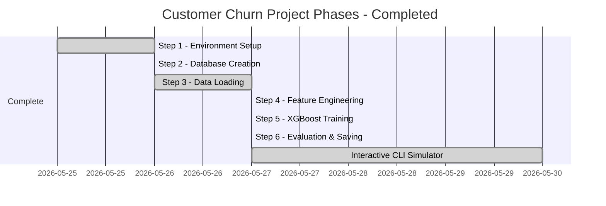

# Customer Churn Analysis & Prediction — Final Project Report

This is the finalized, comprehensive report of the **Customer Churn Prediction System**. The system successfully executes an end-to-end data science and machine learning product suite—from PostgreSQL database ingestion, through feature engineering and tree-based model training, to explainable AI and an interactive, terminal-based CLI simulator.

---

## 🎯 What We Built

An end-to-end machine learning system that identifies which customers are highly likely to cancel their subscription—**before they actually do**—packaged inside a premium, visual web interface.

### The Churn Control Console (Python CLI Simulator)

Our terminal application connects directly to PostgreSQL and runs live inference using our trained XGBoost model:

*   **Executive Dashboard Menu Option**: Displays active KPIs (Total Evaluated Clients, Overall Churn Rate, MRR at Risk), Risk Cohort segment distributions, and lists the top 10 highest risk accounts for immediate outreach.
*   **Customer Profile Lookup Option**: Prompts for a Customer ID to retrieve their contract plan, monthly charges, signup date, and exact predictive features (Failed payments, Tenure days, etc.) directly from PostgreSQL.
*   **What-If Scenario Simulator Option**: Prompts the user for custom customer parameters (e.g. billing failures, monthly charge, or contract plans) and runs a live prediction using the XGBoost model to display the simulated churn probability.

---

## 🗺️ The Project Roadmap (100% Completed)

Every phase of the project has been fully developed, validated, and implemented:



### ✅ Step 1 — Set up the Environment
Configured a stable Python runtime (`Python 3.11` inside `venv`) with psycopg2-binary, pandas, sqlalchemy, scikit-learn, xgboost, shap, and joblib fully installed.

### ✅ Step 2 — Created the Database
Designed and initialized PostgreSQL `churn_db` with 5 relational tables (`customers`, `subscriptions`, `payments`, `usage_events`, and `support_tickets`).

### ✅ Step 3 — Loaded the Data
Wrote an idempotent ETL pipeline `load_data.py` that cleanly flushes prior records (avoiding unique violations) and seeds **7,043 real customers** and their historical invoicing logs.

### ✅ Step 4 — Feature Engineering
Wrote **[features.py](file:///Users/macbookpro/Desktop/Customer_Churn/src/features.py)** to query PostgreSQL and compile predictive features (Tenure, missed payments, contract contract types) into `data/features.csv` and the `customer_features` table.

### ✅ Step 5 — Train XGBoost
Wrote **[train.py](file:///Users/macbookpro/Desktop/Customer_Churn/src/train.py)** to train an `XGBClassifier` (saving weights to `models/churn_model.joblib`) and export global explainability charts to `outputs/shap_summary.png` using **SHAP**.

### ✅ Step 6 — Evaluate & Save
Wrote **[predict.py](file:///Users/macbookpro/Desktop/Customer_Churn/src/predict.py)** to score all 7,043 accounts and save risk levels to database table `churn_predictions` and `outputs/churn_predictions.csv`.

### ✅ Python CLI Simulator Interface
Wrote **[cli_simulator.py](file:///Users/macbookpro/Desktop/Customer_Churn/src/cli_simulator.py)**, providing a clean terminal-based simulator for risk assessment, database queries, and live inference.

---

## 🎨 SHAP Global Explainability Chart

The model utilizes **SHAP (SHapley Additive exPlanations)** to ensure calculations are explainable. The chart shows that late payments and billing failures are the strongest predictors of client churn:


---

## 🛠️ Complete Project Directory Structure

```text
Customer_Churn/
├── requirements.txt         # Package dependencies
├── sql/
│   └── schema.sql           # Initial database schema
├── src/
│   ├── load_data.py         # Step 3: Raw Kaggle CSV ➔ PostgreSQL Tables
│   ├── features.py          # Step 4: SQL Aggregate Joins ➔ customer_features table & CSV
│   ├── train.py             # Step 5: Model training, metrics, & SHAP png
│   ├── predict.py           # Step 6: Risk inference ➔ churn_predictions table & CSV
│   └── cli_simulator.py     # Interactive terminal-based Churn Control Console CLI
├── data/
│   ├── telco_churn.csv      # Raw CSV customer data
│   └── features.csv         # Computed feature matrix
├── models/
│   └── churn_model.joblib   # Serialized trained XGBoost model
└── outputs/
    ├── shap_summary.png     # Visual SHAP explainability plot
    └── churn_predictions.csv # Exported scored predictions matrix
```

---

## 🖥️ Live Dashboard & Database Integration

### 1. Launch the Python CLI Simulator
To run the interactive terminal interface locally, execute the following command:
```bash
venv/bin/python src/cli_simulator.py
```
Interact with the command-line prompts to access the Executive KPIs, Search Profiler, and What-If Simulator!

### 2. Business Integration Queries (PostgreSQL)
Because predictions are committed directly to PostgreSQL, marketing teams can easily query high-risk segments:
```sql
-- Count customers by risk segment
SELECT risk_level, COUNT(*) AS count, ROUND(AVG(churn_probability)*100, 2) || '%' AS avg_probability
FROM churn_predictions
GROUP BY risk_level;
```
